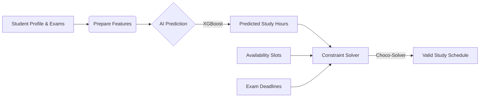

# Project Report: Intelligent Study Planner
**Course:** AI Techniques and Agent Technology

## 1. Problem Addressed
Students often struggle to create effective study schedules that balance their academic workload with their personal lives. Key challenges include:
*   **Time Management:** Difficulty in allocating appropriate time for each subject based on its difficulty and the student's current performance.
*   **Complex Constraints:** Balancing school/tuition hours, commute fatigue, and personal availability.
*   **Exam Deadlines:** Ensuring all topics are covered before upcoming exam dates.
*   **Personalization:** A "one-size-fits-all" schedule fails to account for individual factors like English fluency (for English medium contexts), stream (Bio/Math/Arts), and location-based factors (District).

The **Intelligent Study Planner** addresses this by automating the scheduling process. It creates a personalized study plan that predicts the necessary study duration for each subject and fits it into the student's free time, ensuring optimal preparation without burnout.

## 2. Approach
The solution employs a **Hybrid AI Architecture**, effectively combining the strengths of **Machine Learning (ML)** and **Constraint Programming (CP)**. This hybrid approach is chosen to address the two distinct natures of the scheduling problem: *uncertainty* and *strict rules*.

### 2.1 Why Hybrid AI?
*   **Machine Learning for Uncertainty:** Human factors like "how long will it take to study this?" are inherently uncertain and subjective. They depend on fatigue, subject difficulty, and personal ability. A rigid algorithm cannot easily estimate this. ML is perfect here because it learns patterns from data to make intelligent *predictions*.
*   **Constraint Programming for Rules:** Time is rigid. A day has exactly 24 hours, and an exam has a hard deadline. ML models are probabilistic and can make mistakes (e.g., scheduling a session at 3 AM or overlapping two exams). Constraint Programming is deterministic and ensures that *hard rules* are never broken.

By combining them, we get the best of both worlds: **Personalized Estimates (ML)** fed into **Guaranteed Valid Schedules (CP)**.

### 2.2 The Workflow
1.  **Input Analysis:** The system first analyzes the student's profile (Stream, District, Fluency) and the specific subject (Difficulty, Current Score).
2.  **Predictive Phase (The "How Much"):** The XGBoost model predicts the required study duration. For example, it might determine that a student with high "Commute Fatigue" needs 2.5 hours for a difficult Math module, whereas a fresh student might need only 1.5 hours.
3.  **Constructive Phase (The "When"):** These predicted durations are passed to the Constraint Solver. The solver treats the schedule as a puzzle, trying to fit these blocks of time into the student's available slots without overlapping, ensuring every session fits before its respective deadline.

## 3. Implementation Details

### 3.1 Technology Stack
*   **Backend:** Java Spring Boot (Robust REST API framework).
*   **AI Model:** XGBoost Regressor (Extreme Gradient Boosting) - chosen for its high performance on structured/tabular data.
*   **AI Runtime:** ONNX Runtime (Open Neural Network Exchange) - allows running the Python-trained model natively within the Java JVM with high performance.
*   **Logic Solver:** Choco-Solver - A Java library for Constraint Programming (CP) used to solve the scheduling CSP.
*   **Frontend:** React.js - Provides a responsive UI with dynamic 24-hour schedule visualization, rendering Study, Sleep, and Tuition blocks.
*   **Database:** MySQL/H2 - Stores persistent data (Student profiles, Exams, Availability).

### 3.2 AI Component: Study Duration Prediction
The AI component is responsible for the "intelligence" of the system. It moves away from static rules to dynamic, personalized predictions.

*   **Model Architecture:** We utilize an **XGBoost Regressor**. Gradient boosting is highly effective for regression tasks on tabular data.
*   **Training Process:**
    *   **Data:** The model was trained on `sri_lankan_student_data.csv`, which contains historical data of students' study habits and performance.
    *   **Features:**
        *   *Stream & District:* Capture socio-educational context.
        *   *Difficulty Level & Current Score:* Capture academic context.
        *   *English Fluency:* Critical for students studying in English medium.
        *   *Fatigue & Tuition:* Physical constraints affecting study efficiency.
    *   **Export:** The trained model is exported to **ONNX (Open Neural Network Exchange)** format. This is a critical step as it decouples the training environment (Python) from the production environment (Java), eliminating the need for a separate Flask/Django inference server.
*   **Inference (Java):** The `PredictionService` loads the `.onnx` file once during application startup (`@PostConstruct`). When a schedule is requested, it converts the student's live data into `OnnxTensor` objects and queries the model to get the predicted `hours_needed`.

### 3.3 Logic Component: Intelligent Scheduling
The `ConstraintService` solves the "Timetabling Problem" using **Constraint Satisfaction Problem (CSP)** techniques provided by **Choco-Solver**.

*   **Problem Modeling:**
    *   **Variables:** For each study session, we define three integer variables:
        *   `Start`: The time slot the session begins.
        *   `Duration`: Fixed based on the AI prediction.
        *   `End`: `Start + Duration`.
    *   **Domain:** The "Horizon" (time range) is discretized into 30-minute slots. The domain of the `Start` variable is restricted to valid integers representing these slots.

*   **Constraints Applied:**
    1.  **Availability (Domain Reduction):** We pre-process the student's `Availability` to create a bitmask of valid slots. We apply a `Member` constraint: `Start ∈ {Valid Slots}`. This guarantees zero overlap with School or Tuition hours, ensuring study sessions only occur during truly free time.
    2.  **Hard Deadlines:** `End <= Exam_Deadline`. This ensures the study session happens *before* the exam.
    3.  **Non-Overlapping (Resource Constraint):** We use the `Cumulative` constraint. We treat the student as a "resource" with a capacity of 1. Each study task consumes 1 unit of capacity. This mathematically guarantees that two study sessions can never overlap in time.

*   **Search Strategy:** The solver uses a backtracking algorithm with constraint propagation. It tentatively assigns a start time, propagates the implications (removing invalid future options), and backtracks if a conflict arises, ensuring a valid schedule is found if one exists.

---

### 3.4 Frontend Component: Personalized Schedule Visualization
The frontend goes beyond simple lists by synthesizing a complete 24-hour view of the student's day. Since the database only stores "Availability" and "Study Sessions", the frontend logically derives the remaining context:

*   **Sleep Blocks (Night Mode):** Calculated based on the student's `Average Sleep Hours`. If a student needs 8 hours and wakes at 6:00 AM, the system visually blocks off 10:00 PM - 6:00 AM as "Sleep".
*   **Tuition/School Blocks (Gray):** Derived from the gaps in `Availability`. Any time between waking up and sleeping that is *not* marked as "Available" is automatically rendered as "School / Tuition", ensuring the student sees a realistic full-day plan.
*   **Study Sessions (Color Coded):** The AI-generated sessions are overlaid onto the "Available" slots.

This visualization strategy solves the common "Overlap Confusion" by visually separating fixed constraints (School/Sleep) from flexible study time.

---

## 4. System Diagrams

### 4.1 System Architecture Diagram
This diagram shows how the components interact.

**Description for creation:**
*   Create a box named "Frontend (React)".
*   Create a box named "Backend (Spring Boot)".
*   Inside Backend, show "Controller", "PredictionService (AI)", and "ConstraintService (Logic)".
*   Show "ONNX Model" connected to "PredictionService".
*   Show "Database" connected to Backend.

**Mermaid Code (You can use this to generate the diagram):**
```mermaid
graph TD
    User[Student] -->|Request Schedule| UI[Frontend (React)]
    UI -->|API Call| API[Backend API (Spring Boot)]
    API -->|Get Student Data| DB[(Database)]
    API -->|1. Predict Hours| AI[PredictionService]
    AI -->|Load| ONNX[ONNX Model (XGBoost)]
    AI -->|Return Hours| API
    API -->|2. Generate Schedule| Logic[ConstraintService]
    Logic -->|Solve CSP| Choco[Choco-Solver]
    Logic -->|Return Sessions| API
    API -->|Save Schedule| DB
```

### 4.2 AI & Logic Workflow
This diagram explains the step-by-step flow of data.

**Description for creation:**
*   Start with "Student Data & Exam List".
*   Step 1: "Pre-processing" (OneHotEncoding inputs).
*   Step 2: "AI Prediction" (Input features -> XGBoost -> Hours).
*   Step 3: "Constraint Modeling" (Define Tasks, Apply Availability/Deadlines).
*   Step 4: "Solving" (Find valid slots).
*   End: "Final Schedule".

**Mermaid Code:**


---

## Appendix: Code Highlights

### A. AI Implementation (PredictionService.java)
This section highlights how the ONNX model is loaded and used to make predictions.

**1. Loading the Model:**
The `init()` method initializes the ONNX environment and loads the pre-trained model file.
```java
@PostConstruct
public void init() {
    try {
        // Initialize ONNX runtime
        environment = OrtEnvironment.getEnvironment();

        // Load the trained XGBoost model (exported as .onnx)
        String modelPath = "src/main/resources/Study_predictor_improved.onnx";
        session = environment.createSession(modelPath, new OrtSession.SessionOptions());
    } catch (Exception e) {
        e.printStackTrace();
    }
}
```

**2. Making a Prediction:**
The `predictStudyHours` method converts Java data types into ONNX Tensors (handling categorical and numerical inputs) and runs the model.
```java
public float predictStudyHours(String stream, String district, float difficulty, ...) {
    try {
        // Convert inputs to ONNX Tensors
        OnnxTensor streamTensor = OnnxTensor.createTensor(environment, new String[] { stream }, new long[] { 1, 1 });
        // ... (other tensors created here)

        Map<String, OnnxTensor> inputs = Map.of(
                "stream", streamTensor,
                "difficulty_level", difficultyTensor,
                // ...
        );

        // Run inference
        try (OrtSession.Result result = session.run(inputs)) {
            float[][] output = (float[][]) result.get(0).getValue();
            return output[0][0]; // Return predicted hours
        }
    } catch (Exception e) {
        return 2.0f; // Fallback
    }
}
```

### B. Logic Implementation (ConstraintService.java)
This section shows how the Constraint Satisfaction Problem (CSP) is modeled using Choco-Solver.

**1. Defining Tasks and Variables:**
Each study session is defined as a `Task` with a variable start time (`start`) and a fixed duration (`dur`).
```java
// Create Task Variable
IntVar start = model.intVar("start_" + subject.getName(), 0, horizon - duration);
IntVar end = model.intVar("end_" + subject.getName(), 0, horizon);
IntVar dur = model.intVar(duration); 

Task task = new Task(start, dur, end);
```

**2. Applying Constraints:**
We ensure the task starts in a valid slot (Availability) and finishes before the deadline.
```java
// 1. Availability Constraint: Task must start in a valid time slot
int[] validStarts = getValidStartIndices(availableSlots, horizon, duration);
model.member(start, validStarts).post();

// 2. Deadline Constraint: Task must end before the exam deadline
long deadlineSlots = Duration.between(scheduleStart, exam.getDeadline()).toMinutes() / SLOT_MINUTES;
model.arithm(end, "<=", (int) deadlineSlots).post();
```

**3. Solving:**
The `cumulative` constraint prevents overlaps, and the solver finds a solution.
```java
// 3. Non-Overlapping Constraint (Capacity = 1 means one subject at a time)
model.cumulative(tasksArray, heights, capacity).post();

// 3. Solving:
// ... (previous content)
if (solver.solve()) {
    // Extract solution and convert to StudySession objects
}
```

### C. Data Preparation Process (DataGenerator.py)
To train the AI model effectively, we required a large and diverse dataset. Since real-world data was unavailable, we developed a synthetic data generator script (`DataGenerator.py`) to create a realistic dataset of 10,000 students (`sri_lankan_student_data.csv`).

**1. Logic & Feature Engineering:**
*   **Streams:** Distributed based on popularity (e.g., Physical Science 30%, Arts 10%).
*   **English Fluency:** Modeled as a function of the District. Students from urban centers like Colombo/Kandy have higher randomized fluency scores than those from rural areas.
*   **Target Calculation (`hours_needed`):** The core "Ground Truth" for the AI to learn. We derived this using a logical formula:
    *   Base hours = `Difficulty * 2.0`.
    *   **Context Modifiers:**
        *   Science streams: `* 1.2` (More grinding required).
        *   Low English Fluency: `+ 1.5` hours (Language barrier).
        *   High Tuition: `* 1.1` (Burnout factor).
        *   Smart Students (High current score): Reduced hours.

**2. Code Highlight (Target Calculation):**
```python
def calculate_sl_hours(row):
    hours = row['difficulty_level'] * 2.0

    # Science Stream normally needs more grind
    if row['stream'] in ['Physical Science', 'Bio Science']:
        hours *= 1.2
    
    # English barrier
    if row['english_fluency'] < 5:
        hours += 1.5
        
    # Smart Student (Reduction)
    hours -= (row['current_score'] / 30)

    # Tuition Burnout
    if row['tuition_hours_weekly'] > 10:
        hours *= 1.1
    
    # Add noise for realism
    noise = np.random.normal(0, 0.5)
    return max(1.0, round(hours + noise, 1))
```

### D. Model Training Process (train_improved_model.py)
We utilized a Scikit-Learn Pipeline to integrate preprocessing and model training, simplifying the export process.

**1. Preprocessing:**
*   **Categorical Data:** `OneHotEncoder` converts `stream` and `district` into numerical vectors.
*   **Numerical Data:** Passed through unchanged.

**2. Algorithm Selection:**
*   **XGBoost Regressor:** Chosen for its superior performance on tabular data and ability to handle non-linear relationships.
    *   Hyperparameters: `n_estimators=100`, `max_depth=4`.

**3. ONNX Export:**
*   To use the Python-trained model in our Java Backend, we convert it to the **ONNX (Open Neural Network Exchange)** format using `skl2onnx` and `onnxmltools`.

**Code Highlight (Pipeline & Export):**
```python
# 1. Create Pipeline
model = Pipeline(steps=[
    ('preprocessor', preprocessor),
    ('regressor', xgb.XGBRegressor(n_estimators=100, max_depth=4))
])

# 2. Train
model.fit(X, y)

# 3. Convert to ONNX for Java compatibility
onx = to_onnx(model, X[:1])
with open("Study_predictor_improved.onnx", "wb") as f:
    f.write(onx.SerializeToString())
```
